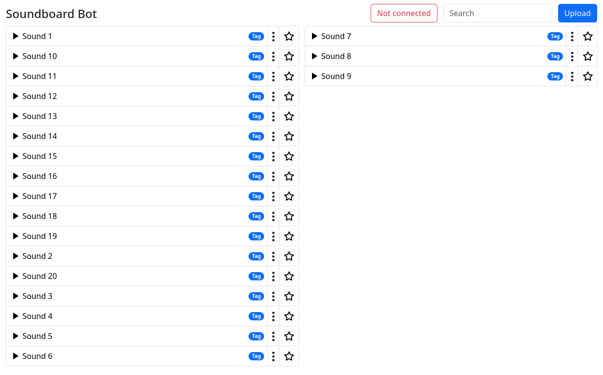
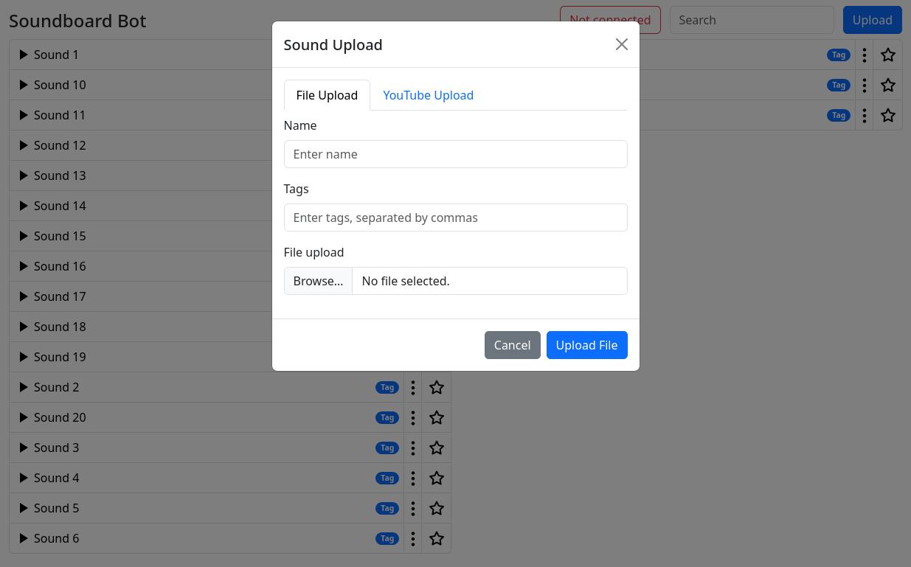

[](https://github.com/bergdinkle/soundboard-bot/actions/workflows/build-and-push.yaml)

# Soundboard Bot for Discord


This project aims to offer a free alternative to the paid Discord Nitro soundboard feature as a self-hosted bot.
It allows users to upload, manage, and play sounds directly within their Discord server.
The bot supports file uploads and YouTube links, providing a versatile and customizable soundboard experience.

The bot offers you the following features:

- Upload and manage sounds 📡
- Play sounds over the web interface 🌐
- Support for file uploads and YouTube links 🎥
- Multiple users supported 🧑‍🤝‍🧑
- Admin controls for user management 🛑
- Web interface for easy sound management 🖥️
- Download sounds from YouTube 🎵


## Getting Started

### Docker
The easiest way to run the bot is by using Docker. You can pull the latest image from GitHub Container Registry by running:
```shell
docker pull ghcr.io/bergdinkle/soundboard-bot:latest
```

Then, you can run the bot with the following command:
```shell
docker run -d --name soundboard-bot
    -e SOUNDBOARD_BOT_DISCORD_TOKEN=<your-discord-bot-token>
    -e SOUNDBOARD_BOT_TOKEN_SECRET=<some-random-secret> # You can generate this with e.g. `openssl rand -hex 32`
    -p 8080:8080
    ghcr.io/bergdinkle/soundboard-bot:latest
```
The logs show your new Admin token on first startup. You can use this token to log in to the web interface and manage your sounds.

To make the bot join your voice channel in Discord, simply write `!join` while you are connected.

### Docker compose
```yaml
services:
  soundboard-bot:
    image: ghcr.io/bergdinkle/soundboard-bot:latest
    environment:
      - SOUNDBOARD_BOT_DISCORD_TOKEN=<your-discord-bot-token>
      - SOUNDBOARD_BOT_TOKEN_SECRET=<some-random-secret> # You can generate this with e.g. `openssl rand -hex 32`
    ports:
      - 8080:8080
```


## Screenshots





## Development

### Devcontainer
This project is set up to run in a devcontainer. To get started, you need to have Docker and Visual Studio Code installed.
Then, open the project in Visual Studio Code, "Reopen in Container" and wait for the devcontainer to build. Once it's done, you can run the project by executing `./gradlew run` in the terminal.
